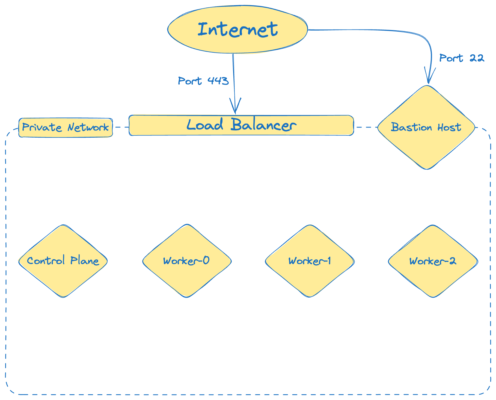

# Terraform Hetzner K8s

# ⚠️⚠️⚠️!!!WIP!!!⚠️⚠️⚠️



```bash

ssh -i ./ansible/private_key.pem -o StrictHostKeyChecking=no ubuntu@<controlplane_ip> -o ProxyCommand="ssh -o StrictHostKeyChecking=no -i ./ansible/private_key.pem -W %h:%p -q root@<bastion_host_ip>"

kubectl create -f https://raw.githubusercontent.com/projectcalico/calico/v3.26.1/manifests/tigera-operator.yaml

kubectl create -f https://raw.githubusercontent.com/projectcalico/calico/v3.26.1/manifests/custom-resources.yaml

```

## Install Hetzner Cloud Controller Manager

```bash
kubectl -n kube-system create secret generic hcloud --from-literal=token=<hetzner_api_token> --from-literal=network=network-kubernetes
kubectl apply -f https://github.com/hetznercloud/hcloud-cloud-controller-manager/releases/latest/download/ccm-networks.yaml
```

https://github.com/hetznercloud/hcloud-cloud-controller-manager


## Install Hetzner CSI Driver

```bash

```
https://github.com/hetznercloud/csi-driver

https://github.com/hetznercloud/csi-driver/blob/main/docs/kubernetes/README.md#getting-started
```